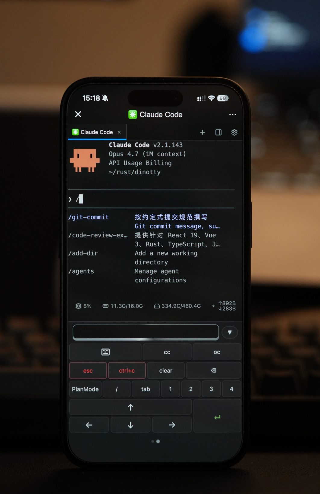
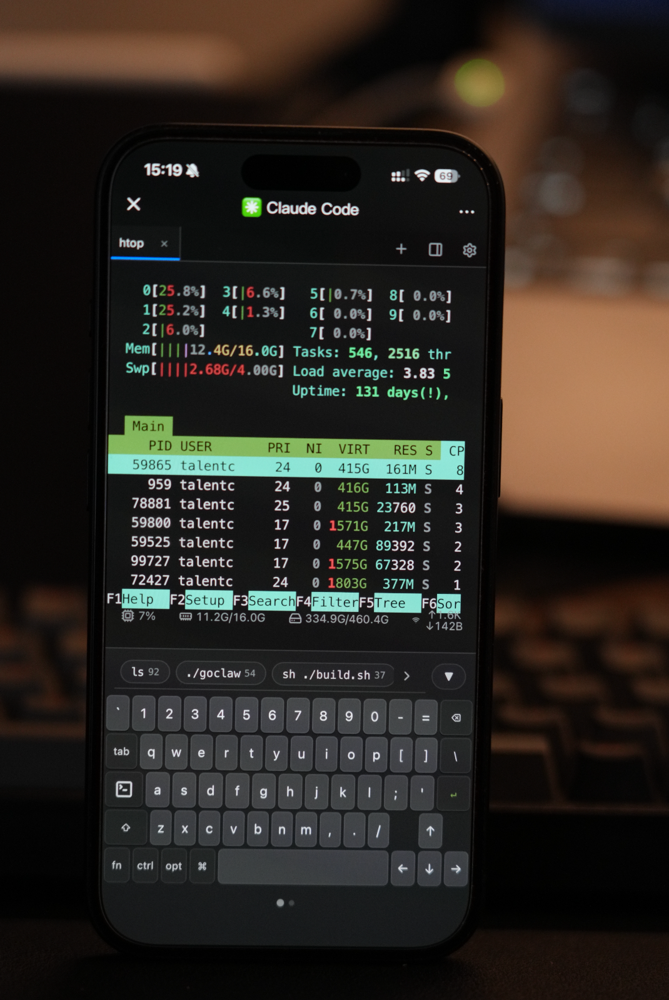
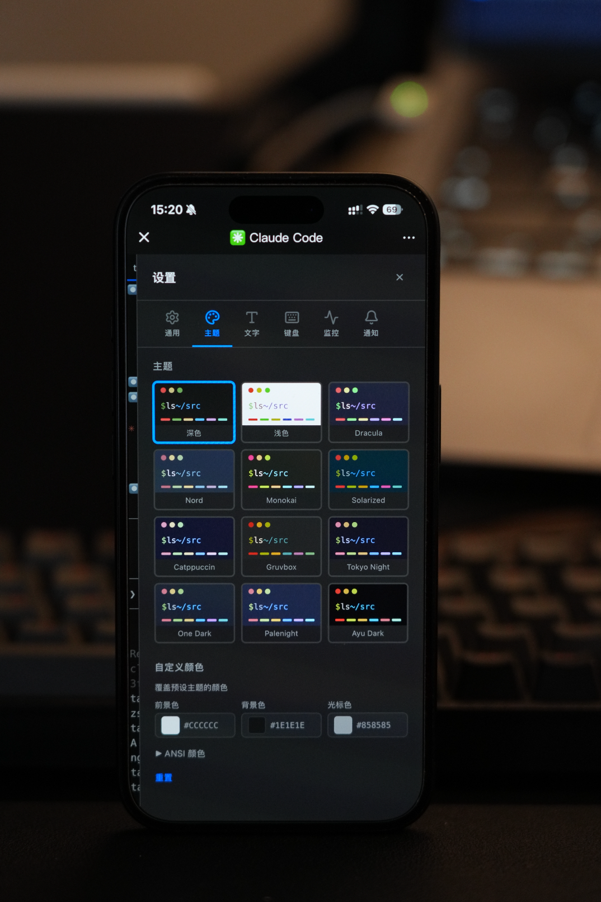
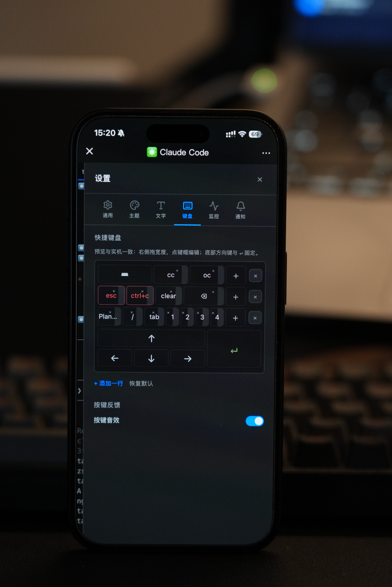
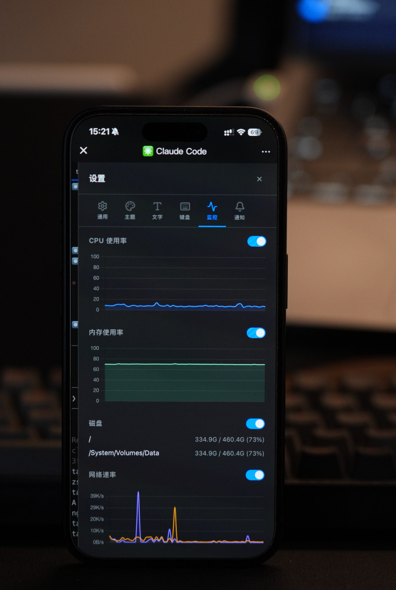
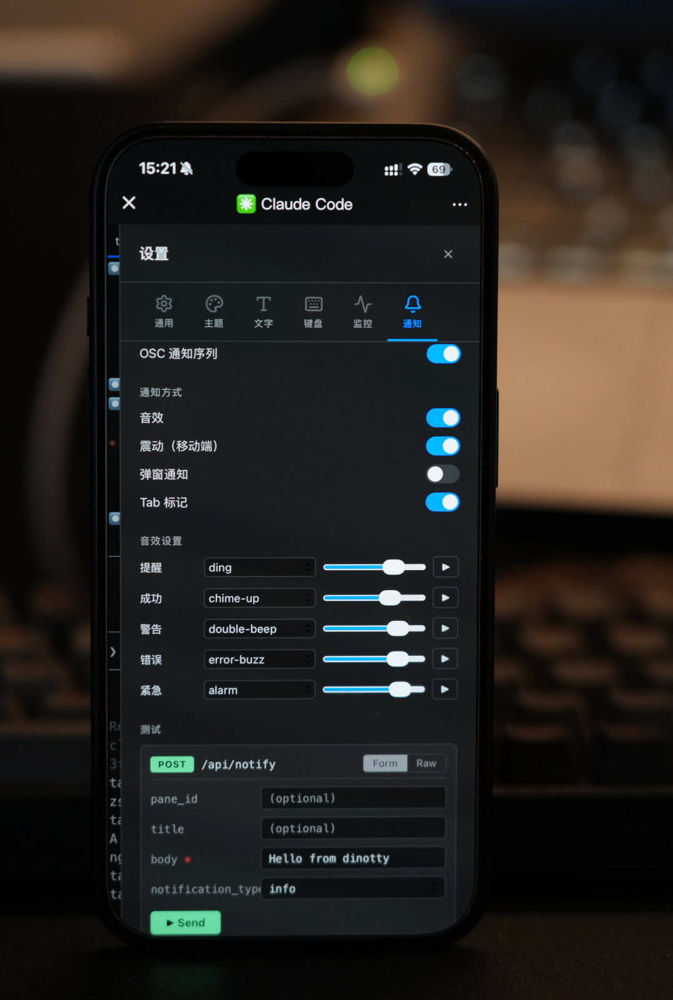
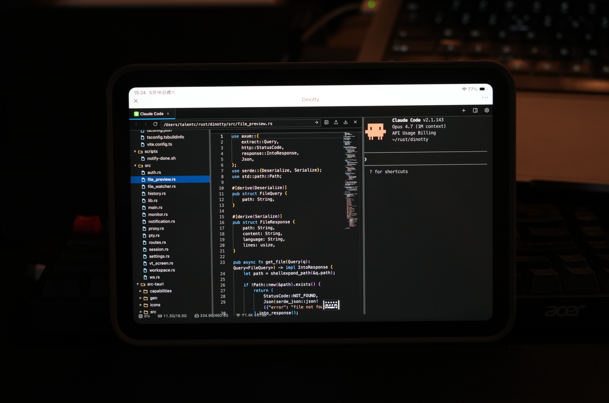

<p align="center">
  
</p>

<h1 align="center">Dinotty</h1>

<p align="center">
  <a href="./README.en.md">English</a> | 中文
</p>

---

为 **Coding Agent** 打造的**多端同步**终端服务器。在任意设备上运行 Claude Code、opencode、Codex 或 OpenClaw，桌面端专业高效，移动端随时掌控——无缝切换，会话永不丢失。

## 截图

<p align="center">
  
  
  
</p>
<p align="center">
  
  
  
</p>
<p align="center">
  
</p>

## 为什么选择 Dinotty？

终端 Coding Agent（Claude Code、opencode、Codex、OpenClaw 等）功能强大，但它们被束缚在单一终端窗口里。Dinotty 让你：

- **在任意设备上管理 agent**——桌面端深度编码，离开工位时手机扫码即可继续查看和管理 agent 工作，工作连贯不中断
- **多端同步，无缝切换**——电脑上写到一半，掏出手机继续；回到电脑，一切原样
- **直接验证 agent 产出**——代码 diff、渲染的网页、生成的文件，内置浏览器一目了然
- **永远不会丢失会话**——断网、息屏、切换设备——回来后一切都在原处

### 轻量级——不是远程桌面

| | Dinotty | 远程桌面 (VNC/RDP/Parsec) |
|---|---|---|
| **传输数据** | 纯文本（JSON，字节流） | 全屏像素流，30-60 fps |
| **带宽消耗** | 通常 ~1–10 KB/s | ~1–10 MB/s（多 100–1000 倍） |
| **移动网络友好** | ✅ 3G/4G 下流畅无延迟 | ❌ 卡顿、高延迟、流量消耗大 |
| **弱信号容忍度** | ✅ 自动重连，无画面丢失 | ❌ 画面冻结、输入延迟 |
| **电量消耗** | 低（文本渲染） | 高（视频解码） |
| **分辨率适配** | 任意尺寸下原生文本渲染 | 位图缩放，手机上模糊 |
| **交互方式** | 原生触控 + 自定义键盘 | 模拟鼠标，桌面 UI 在手机上很小 |

## 核心特性

- **服务端虚拟终端** — 完整 VTE 解析，服务端掌握精确屏幕状态，支持会话恢复与屏幕快照
- **会话持久化** — PTY 进程在断网后存活，自动重连 + 指数退避，刷新页面即可恢复
- **分屏与多 Tab** — 可拖拽分屏、多 Tab 管理，服务端主导的 Pane 生命周期
- **服务器列表** — 管理多台远程服务器，快速切换连接
- **响应式布局** — 竖屏上下排列，横屏左右并排；触控优化的按钮与面板缩放
- **可自定义快捷键盘** — 为手机补齐 Ctrl/Esc/功能键，支持任意转义序列
- **内建文件浏览器** — 代码高亮、Markdown 渲染、Office 文档预览、音视频播放
- **Git 变更指示** — 编辑器 gutter 增/改/删标记，inline diff，Stage/Revert
- **网页预览** — 内建反向代理，在 iframe 中预览本地开发服务器
- **通知系统** — 终端 bell/OSC 检测，WebSocket 推送，可配置声音提醒
- **系统监控** — 实时 CPU/内存/网络图表
- **插件系统** — JS 插件 + CLI 桥接，热重载，内置 CC Switch、JSON Formatter 等
- **Open API** — HTTP 端点，支持 Stream Deck、快捷指令等外部设备控制
- **命令面板** — 快速访问命令启动器
- **桌面应用** — 可选 Tauri 原生客户端

## 与其他终端的对比

| 能力 | Dinotty | ttyd | gotty | Wetty |
|---|---|---|---|---|
| 服务端虚拟终端（VT Screen） | ✅ | ❌ | ❌ | ❌ |
| 会话在断网后存活 | ✅ | ❌ | ❌ | ❌ |
| 刷新页面 = 恢复会话 | ✅ | ❌ | ❌ | ❌ |
| 内建文件浏览器和预览 | ✅ | ❌ | ❌ | ❌ |
| Git 变更指示 | ✅ | ❌ | ❌ | ❌ |
| 内建网页预览（反向代理） | ✅ | ❌ | ❌ | ❌ |
| 可自定义快捷键盘 | ✅ | ❌ | ❌ | ❌ |
| 插件系统 | ✅ | ❌ | ❌ | ❌ |
| Token 认证 | ✅ | ✅ | ❌ | ✅ |

其他 Web 终端只是 WebSocket 到 PTY 的透传管道。Dinotty 在服务端运行**完整的虚拟终端仿真器**，使得会话恢复、屏幕快照成为可能，结合内建文件/网页浏览器，提供自包含的 Coding Agent 工作环境。

## AI Coding 方案对比

| | Dinotty | Claude Code Remote | Codex Web | Happy | hapi | Termius | tmux |
|---|---|---|---|---|---|---|---|
| 定位 | Web 终端服务器 | 内建多端同步 | 云端 Agent | AI Agent 远程客户端 | AI Agent 远程客户端 | SSH 客户端 | 终端复用器 |
| 技术方案 | 服务端 VTE + Web UI | Anthropic 云 + 本地 | OpenAI 云 | CLI 代理包装 | CLI 代理包装 | 原生 App | 服务端进程 |
| Web 访问 | ✅ | ✅ claude.ai/code | ✅ chatgpt.com/codex | ✅ | ✅ PWA | ❌ | ❌ |
| 原生 App | Tauri（可选） | iOS + Android | ❌ | iOS + Android | ❌（PWA） | 全平台 | ❌ |
| 通用终端 | ✅ 任意命令 | ❌ 仅 AI Agent | ❌ 仅 AI Agent | ❌ 仅 AI Agent | ❌ 仅 AI Agent | ✅ SSH | ✅ |
| Coding Agent 适配 | ✅ 文件浏览/预览/通知 | ✅ 内建 | ✅ 内建 | ✅ 语音/审批 | ✅ 语音/工作区 | ❌ | ❌ |
| 插件系统 | ✅ | ❌ | ❌ | ❌ | ❌ | ❌ | ❌ |
| 多端同步 | ✅ 浏览器即同步 | ✅ 跨设备会话同步 | ✅ 云端会话 | ✅ | ✅ | ✅ Vault | ❌ 需 SSH |
| 中继服务 | 计划中 | ✅ Anthropic 托管 | ✅ OpenAI 托管 | ✅ | ✅ | SaaS | ❌ |
| 部署方式 | 自托管 | SaaS | SaaS | 中继服务 | 自托管/中继 | SaaS | 自托管 |
| 代码运行位置 | 自有服务器 | 本地 / Anthropic 云 | OpenAI 云 | 本地 | 本地 | 远程 SSH | 远程服务器 |

Claude Code 和 Codex 各自提供了内建的远程方案，但仅限于自身 Agent 生态。Happy/hapi 是第三方远程控制层，包装 CLI 实现手机审批和语音交互。Dinotty 是通用 Web 终端服务器，Agent 在服务端原生运行，同时提供文件浏览、网页预览、插件系统等完整工作环境，桌面端和移动端均有专业体验。

## 快速开始

```bash
# 构建前端
cd frontend && pnpm install && pnpm run build && cd ..

# 运行服务器
cargo run
```

在浏览器中打开 http://127.0.0.1:8999 。

```bash
# 带调试日志运行
RUST_LOG=debug cargo run

# 前端类型检查
cd frontend && npx vue-tsc --noEmit
```

## 技术栈

| 层级 | 技术 |
|------|------|
| 后端 | Rust, Axum 0.7, Tokio, portable-pty, vte |
| 前端 | Vue 3, TypeScript, Vite, xterm.js 5 |
| 桌面端 | Tauri |

## 项目结构

```
src/               # Rust 后端
  main.rs          # Axum 路由与服务入口
  lib.rs           # 库入口
  ws.rs            # WebSocket ↔ PTY 桥接
  vt_screen.rs     # 虚拟终端仿真器（基于 VTE）
  session.rs       # 会话管理器（多面板）
  pty.rs           # PTY 创建与管理
  tabs.rs          # Tab 与 Pane 管理
  history.rs       # 会话历史记录
  workspace/       # 文件工作区 API
  proxy/           # 反向代理（预览）
  monitor.rs       # 系统监控
  notification.rs  # 通知广播（bell/OSC 检测）
  plugin/          # 插件系统管理
  settings.rs      # 设置持久化
  auth.rs          # 身份认证
  file_watcher.rs  # 文件变更监听

frontend/          # Vue 3 SPA
  src/
    App.vue
    components/
      split/           # SplitContainer, TabBar, PaneHeader, StatusBar
      terminal/        # TerminalPane, MonitorPopover
      command/         # CommandPalette, CommandBookmarks
      keyboard/        # MobileKeyboard, HistoryPanel, SuggestionBar
      notification/    # NotificationPanel, NotificationCard
      preview/         # FileWorkspacePreview, PreviewPanel, WebPreview
      settings/        # 各设置 Tab（General, Theme, Keyboard 等）
      workspace/       # MonacoEditor, FilePreviewContent, gitDecorations
      plugin/          # PluginView
      ui/              # ConfirmModal 等通用组件
      ServerList.vue   # 服务器列表
    composables/   # useTerminal, useTransport, useSettings, useTabApi 等

src-tauri/         # Tauri 桌面客户端
docs/              # 设计文档
```

## WebSocket 协议

通过 `/ws` 传输的 JSON 消息：

| 方向 | `type` | 字段 |
|------|--------|------|
| 客户端 → 服务端 | `input` | `data: String` |
| 客户端 → 服务端 | `resize` | `cols: u16, rows: u16` |
| 服务端 → 客户端 | `output` | `data: String` |
| 服务端 → 客户端 | `shell_info` | `shell_type: String` |

## 更多文档

- [部署指南](docs/deployment.md) — systemd、Docker、跨平台构建、配置说明
- [通知系统](docs/notifications.md) — HTTP API、Claude Code 集成、Open API
- [插件系统](docs/plugins.md) — 安装、清单、API、内置插件
- [插件开发](docs/plugin-development.md) — 完整的插件开发文档
- [贡献指南](docs/contributing.md) — 分支策略、Commit 规范、代码风格

## 贡献者

感谢所有为 Dinotty 做出贡献的人！

<a href="https://github.com/xichan96/dinotty/graphs/contributors">
  
</a>

## Star History

[](https://star-history.com/#xichan96/dinotty&Date)

## 许可证

MIT
